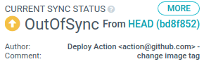
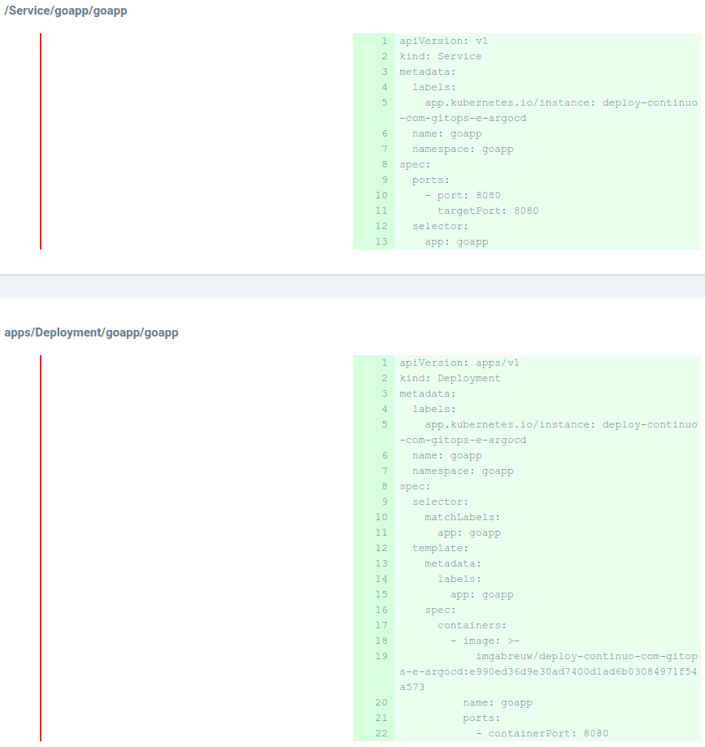
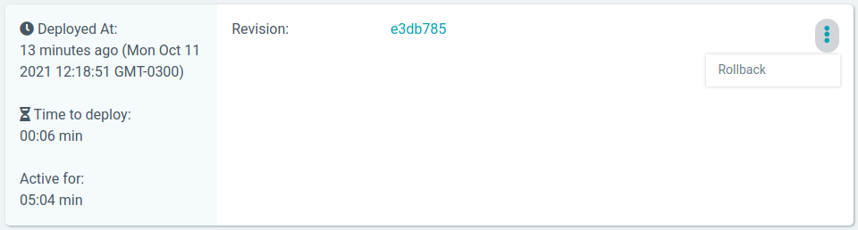
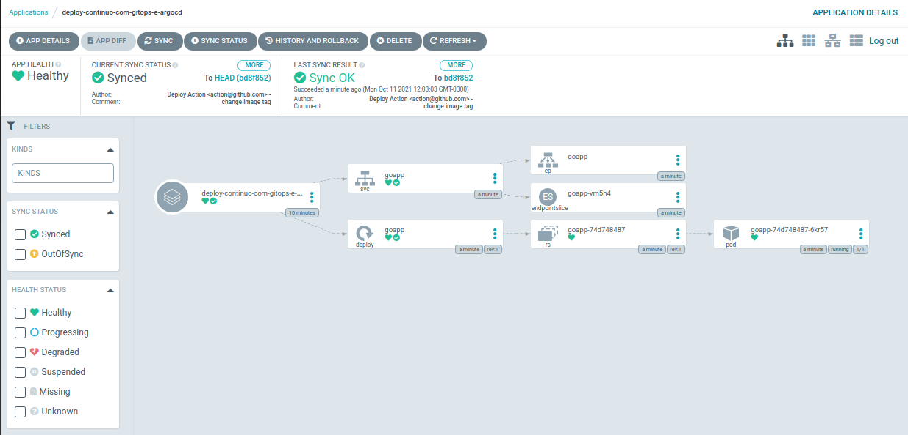

# Deploy Contínuo com GitOps e ArgoCD

### Requisitos

* [Docker](https://www.docker.com/)

* [Kind](https://kind.sigs.k8s.io/)

### Criação do cluster Kubernetes

* `$ kind create cluster --name argocd`

* Verificar se o cluster foi criado com sucesso

  * `$ kubectl get nodes`

### Criar um *Web Server* em Go

```go
package main

import "net/http"

func main() {
	http.HandleFunc("/", func(w http.ResponseWriter, r *http.Request) {
		w.Write([]byte("<h1>Hello World</h1>"))
	})
	http.ListenAndServe(":8080", nil)
}
```

### Containerização da aplicação

* **Dockerfile**

  ```dockerfile
  FROM golang:1.17 AS builder

  WORKDIR /app
  COPY . .
  RUN CGO_ENABLED=0 go build -o server main.go # compilar o arquivo "main.go" em um arquivo executável chamado "server" (flag -o)

  FROM alpine:3.12

  WORKDIR /app
  COPY --from=builder /app/server .
  CMD ["./server"] # Executar o Web Server quando o container subir
  ```

* **Criação da imagem com a TAG latest**

  * `$ docker build -t imgabreuw/deploy-continuo-com-gitops-e-argocd:latest .`

* **Enviar a imagem para o Docker Hub**

  * Fazer o login: `$ docker login`

  * Enviar a imagem com a TAG latest: `$ docker push imgabreuw/deploy-continuo-com-gitops-e-argocd:latest`

* **Rodar a aplicação a partir da imagem enviada ao Docker Hub**

  * `$ docker run --rm -p 8080:8080 imgabreuw/deploy-continuo-com-gitops-e-argocd:latest`

### Deploy da aplicação no Kubernetes (K8S)

* **Objetos necessários para o o deploy**

  * Deployment

    ```yaml
    apiVersion: apps/v1
    kind: Deployment
    metadata:
      name: goapp
    spec:
      replicas: 5
      # Indicar quais aplicações serão gerenciadas por esse Deployment (no caso, todas as aplicações com "app=goapp")
      selector:
        matchLabels:
          app: goapp
      # Definição dos pods
      template:
        metadata:
          labels:
            app: goapp  
        spec:
          containers:
          - name: goapp 
            image: goapp # o Kustomize irá setar a versão da imagem automaticamente
            ports:
            - containerPort: 8080
    ```

    * Aplicar essa nova configuração no cluster Kubernetes

      * `$ kubectl apply -f k8s/deployment.yaml`

  * Service

    ```yaml
    apiVersion: v1
    kind: Service
    metadata:
      name: goapp
    spec:
      # Indicar quais aplicações serão gerenciadas por esse Service
      selector:
        app: goapp
      # Binding de portas
      ports:
      - port: 8080 # porta do Service
        targetPort: 8080 # porta do container
    ```

    > OBS: como tem mais de 1 réplica, o Service fará o balanceamento de carga entre os pods

    * Aplicar essa nova configuração no cluster Kubernetes

      * `$ kubectl apply -f k8s/service.yaml`

    * Binding de portas entre máquina local e o Service

      * `$ kubectl port-forward svc/goapp 8080:8080`

        > Fluxo de redirecionamento: maquina local (8080) > Service (8080) > Pod (Service é responsável por escolher a porta do melhor Pod)

* [Kustomize](https://kustomize.io/)

  * Instalação do Kustomize

    * `$ curl -s "https://raw.githubusercontent.com/kubernetes-sigs/kustomize/master/hack/install_kustomize.sh" | bash && sudo mv kustomize /usr/local/bin`

  * Função: fazer a troca de versão da imagem de forma automática e aplicar as alterações, automaticamente, das configurações no cluster Kubernetes

  * Arquivo de configuração

    ```yaml
    apiVersion: kustomize.config.k8s.io/v1beta1
    kind: Kustomization
    resources:
    - deployment.yaml
    - service.yaml

    namespace: goapp

    images:
      - name: goapp
        newName: goapp
        newTag: v1
    ```

    * Aplicar as configurações no cluster Kubernetes

      * `$ kustomize build k8s`

### Github Action

* Action de build da aplicação

  ```yaml
  name: cd

  on:
    push:
      branches: [master]

  jobs:
    build:
      name: Build
      runs-on: ubuntu-latest
      steps:
        - name: checkout
          uses: actions/checkout@v2 # baixa o código de repositório

        - name: build imagem and push to docker hub
          uses: docker/build-push-action@v1.1.0
          with:
            username: ${{ secrets.DOCKER_USERNAME }}
            password: ${{ secrets.DOCKER_PASSWORD }}
            repository: imgabreuw/deploy-continuo-com-gitops-e-argocd
            tags: ${{ github.sha }}, latest
  ```

* Criar um repositório no Github

* Definir as secrets no repositório

  * Settings > Secrets > botão `New repository secret` > informar a chave e o valor do *secret*

* OBS: criar um *access token* no Docker Hub (para a secret `DOCKER_PASSWORD`)

  * No Docker Hub > ícone do usuário > Account Settings > Security > botão `New Access Token` > informar o nome do token (`Access Token Description`) > botão `Generate`

* Enviar o código para o repositório GitHub

* Action de deploy da aplicação

  ```yaml
  ...

  jobs:
    ...
    deploy:
      name: Deploy
      runs-on: ubuntu-latest
      needs: build
      steps:
        - name: checkout
          uses: actions/checkout@v2

        - name: kustomize
          uses: imranismail/setup-kustomize@v1
          with:
            kustomize_version: v3.6.1

        - name: update k8s
          run: |
            cd k8s
            kustomize edit set image goapp=imgabreuw/deploy-continuo-com-gitops-e-argocd:${{ github.sha }}
            cat kustomization.yaml

        - name: commit
          run: |
            git config --local user.email "action@github.com"
            git config --local user.name "Deploy Action"
            git commit -am "change image tag"

        - name: push
          uses: ad-m/github-push-action@master
  ```

### [ArgoCD](https://argo-cd.readthedocs.io/en/stable/)

* Instalação do ArgoCD

  * `$ kubectl create namespace argocd && kubectl apply -n argocd -f https://raw.githubusercontent.com/argoproj/argo-cd/stable/manifests/install.yaml`

* Binding de portas entre a máquina local e o serviço do ArgoCD

  * `$ kubectl port-forward svc/argocd-server -n argocd 8080:443`

* Obter a senha do ArgoCD

  * `$ kubectl -n argocd get secret argocd-initial-admin-secret -o jsonpath="{.data.password}" | base64 -d`

* Acessar https://localhost:8080

  * Informar usuário (`admin`) e senha > botão `Sign in`

* Excluir o Deployment e Service

  * `$ kubectl delete deploy goapp` 

  * `$ kubectl delete svc goapp`

* Criar um *namespace* (fazer o deploy com o ArgoCD no namespace `goapp`)

  * `$ kubectl create namespace goapp`

* Criar uma nova aplicação no ArgoCD

  * No painel do ArgoCD (https://localhost:8080/applications) > botão `New App` > informar os seguintes dados

    * `Application Name` = nome da aplicação (no caso, `deploy-continuo-com-gitops-e-argocd`)

    * `Project` = `default`

    * `Repository URL` = repositório no GitHub (no caso, `https://github.com/Aprendendo-programacao/deploy-continuo-com-gitops-e-argocd.git`)

    * `Path` = caminho até os arquivos de configurações do Kubernetes (no caso, `k8s`)

    * `Cluster URL` = url do cluster, basta selecionar a opção sugerida pelo ArgoCD (no caso, https://kubernetes.default.svc)

    * `Namespace` = namespace (o mesmo criado anterior por meio do comando `$ kubectl delete deploy <namespace>`) para fazer o deploy (no caso, `goapp`)

> OBS: verificar se o ArgoCD identificou o *Kustomize*

* Botão `Create`

* Como, anteriormente, foi setado a política de sincronização (*sync policy*) como `manual`, o status de sincronização deve ser de `OutOfSync`, como a mostrado na imagem abaixo

  

  > OBS: para ver a diferença entre as configurações aplicadas no cluster Kubernetes e as presentes no repositório GitHub, basta clicar no botão `App Diff`
    

  * Para sincronizar e aplicar as configurações do repositório para o cluster Kubernetes -> clicar no botão `Sync` > botão `Synchronize`

* Realizar rollback de um cluster Kubernetes no ArgoCD

  * Clicar no Botão `History and rollback` > escolher a versão do cluster Kubernetes a ser restaurada

    

  * Clicar no botão `Rollback` > `Ok`

### Resultado final



* Verificar os Pods criados pelo ArgoCD

  * Sintaxe: `$ kubectl get pods -n <namespace>`

  * Exemplo
  
    * Comando: `$ kubectl get pods -n goapp`

    * Saída

      ```
      NAME                    READY   STATUS    RESTARTS   AGE
      goapp-74d748487-6kr57   1/1     Running   0          5m30s
      ```

* Verificar os Services criados pelo ArgoCD

  * Sintaxe: `$ kubectl get svc -n <namespace>`

  * Exemplo
  
    * Comando: `$ kubectl get svc -n goapp`

    * Saída

      ```
      NAME    TYPE        CLUSTER-IP     EXTERNAL-IP   PORT(S)    AGE
      goapp   ClusterIP   10.96.58.254   <none>        8080/TCP   6m57s
      ```

* Binding de portas (entre Service e máquina local) para acessar o container

  * `$ kubectl port-forward svc/goapp -n goapp 9000:8080`

* Acessar http://localhost:9000/ (antes da sincronização no ArgoCD)

  

  > Como não foi realizado a sincronização, o cluster Kubernetes está utilizando a versão antiga da imagem (com `Hello World`)

* Acessar http://localhost:9000/ (após a sincronização no ArgoCD)

  

  > IMPORTANTE: fazer o binding de portas novamente (`$ kubectl port-forward svc/goapp -n goapp 9000:8080`), pois ao aplicar as novas configurações o cluster Kubernetes é recriado.
